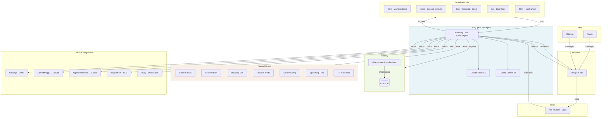

# Building Lyra: A $5/Month Personal AI Assistnat That Actually Works

*The journey from "I need something different" to a working second brain — and what I learned along the way.*

---

I lead ~100 PMs & UXers at N26. I have a wife, a household, a content strategy running across three platforms, and a lot of context that lives in my head. My head is full.

I've used ChatGPT for three years.I wanted something different: an agent that runs in the background, knows my context, takes action on Telegram messages, and genuinely reduces my cognitive load. Not a chatbot I visit — an operator that works for me.

This is the journey of how I built it.

---

## 1. Finding the use cases I actually wanted to automate

Before writing a single line of config, I mapped what I actually needed — not what sounded cool, but what would move the needle.

**For me:**
- Daily news digest: EU financial news, AI news, startup news — filtered and tagged
- Competitor monitoring: Revolut, Monzo, Bunq, Starling — weekly pulse
- Content operations: X daily, LinkedIn weekly, Substack weekly — idea capture and drafting
- Email drafting: nuanced, position-aware, in my voice
- Second Brain: capture every thought I speak into Telegram voice messages

**For household (Abhigna, my wife):**
- Shared reminders that sync to both iPhones
- Shared calendar — joint events visible on both phones
- Health and supplement tracking
- Meal planning
- Trip logistics
- Grocery and shopping lists

The key insight: I didn't start with "what can AI do?" I started with "what do I spend mental energy on every day that I wish I didn't?" The morning digest replaced 20 minutes of tab-hopping. The voice capture replaced a notes app I never revisited. The shared reminders actually get used because they're in the same place as everything else.

---

## 2. Figuring out the workflow

Once I had the use cases, I had to decide how they would flow.

**The interface question:** Why Telegram? It's where I already am. No monthly cost. Works on iOS, Android, Mac, and web. Supports voice messages natively. I didn't want another app to check — I wanted something that showed up where I already am.

**The storage question:** Where does everything live? I chose Notion as the cockpit. Every domain has a database. Lyra reads and writes all of them. The design principle: Lyra is the interface, Notion is the database. The data survives if the agent setup changes. I can view, edit, and share data without going through Lyra.

**The proactive question:** When does Lyra act without being asked? I scheduled crons: morning digest at 7am, content reminder at noon, weekly synthesis on Sunday. The agent doesn't wait for me to remember — it fires whether or not I message it.

**The capture question:** How do I get thoughts into the system with minimal friction? Voice notes. I speak into Telegram. Lyra transcribes, classifies, and stores. No forms. No apps to open. The Sunday brain brief surfaces patterns across the week's captures.

---

## 3. Discovering OpenClaw and testing it

I didn't build a framework from scratch. I evaluated what existed and landed on OpenClaw.

OpenClaw handles the hard parts: session memory, tool routing, multi-channel delivery, cron scheduling, and the skill system. Building all of this from scratch would take months and still be worse. The tradeoff is that you're constrained to what OpenClaw supports — but for a personal agent, it covers everything you actually need.

The key things OpenClaw provides:
- **Workspace files** (`SOUL.md`, `MEMORY.md`) loaded on every conversation — persistent personality and context
- **Cron scheduler** — no external cron service needed, runs inside the same process
- **Skill system** — drop a folder into `~/.openclaw/workspace/skills/` and Lyra gains a new capability
- **LaunchAgent daemon** — one command to make it survive reboots

I ran `openclaw onboard`, set up a Telegram bot, connected Notion, and started testing. The first version worked within a day. The refinement took weeks.

---

## 4. Realising I needed multi-user and deep integration

The breakthrough came when I understood that for end-to-end, real usage, Lyra couldn't be just for me.

**Multi-user:** Abhigna needed to use Lyra too. She has her own reminders, her own calendar events, her own health tracking. We share a household. The agent had to reflect that.

So I built two access tiers on the same bot. She messages Lyra. She can see and update shared databases: Health & Meds, Meal Planning, Upcoming Trips, Shopping List. She cannot see my professional databases. The boundary is enforced at the memory layer — her sessions never retrieve professional context because it lives in a container her queries never touch.

**Deep integration:** Email, reminders, calendars — both of ours. Lyra needed to read and write to:
- My email (via himalaya CLI)
- Our shared Apple Reminders list (syncs to both iPhones via iCloud)
- Our shared Apple Calendar (syncs to Google Calendar)

The integration wasn't optional. It was the difference between "Lyra can do X" and "Lyra actually replaces the mental overhead of X." When I say "add almond milk to shopping list," Lyra updates Notion and Abhigna gets a Telegram notification. When she says "remind Akash to pay the bill," it lands in my Reminders. One agent, two people, shared context where it matters, isolated where it doesn't.

---

## 5. What I got wrong (short excerpts)

### Static memory is a dead end

My first design: write everything about me into a `MEMORY.md` file. Load it every message.

This worked. For about a week. Then I realised: every "add milk" loads a complete professional biography. That's 1,400 tokens of irrelevant context. And it doesn't learn. MEMORY.md only updates when I explicitly say "remember this." Everything I tell Lyra in conversation vanishes at session end.

The fix: semantic memory. LanceDB + Ollama. After every exchange, what matters gets extracted and stored. Before every message, the most relevant memories get retrieved. Relevant context, not all context.

### I was loading 11,000 tokens per message

After a day of heavy use, Lyra started responding "API limit reached" on every other message.

The problem was tokens per minute. Every message loaded ~11,000 tokens. I had verbose SOUL.md, AGENTS.md, BOOTSTRAP.md, NOTION-CONTEXT.md — all loading on every turn including "what's the weather?"

The fix: surgical cleanup. Delete what shouldn't exist, move what doesn't need to be always-on, compress everything else. After the cleanup: 1,890 tokens per turn. An 83% reduction. Then I switched the default model from Sonnet to Haiku. Result: from 3 messages/minute to 69+ messages/minute.

### The daemon doesn't read your shell config

Lyra runs as a macOS LaunchAgent daemon. I had added my API keys to `~/.zshrc`. They worked fine in terminal. They were invisible to the daemon.

macOS daemons do not inherit your shell environment. Fix: add keys to `~/.openclaw/.env` (which OpenClaw loads) or to the LaunchAgent plist. Learned this when Lyra reported "no Tavily API key found" for a week of morning digests.

### Reminders permissions and the daemon problem

I set up Apple Reminders integration. Tested from Terminal — worked perfectly. Lyra tried to use it — failed silently.

The issue: macOS TCC grants permissions per application bundle. "Terminal" has Reminders access. The OpenClaw daemon runs under Node.js with a different bundle identifier. The fix: replace `remindctl` with `osascript`. AppleScript uses Apple Events, which have a more permissive model for background processes.

### Voice capture had no implementation

I wrote a voice capture pipeline in SOUL.md: "transcribe → classify → save to Second Brain." When a voice message arrived, Lyra would say "Captured. [Title] → Second Brain ✓."

Except she wasn't capturing anything. She was hallucinating the confirmation.

OpenClaw doesn't natively transcribe Telegram voice messages. Fix: install `mlx-whisper`, add `ffmpeg` for audio conversion, write the actual pipeline. Now voice messages actually get transcribed, classified, and stored in Notion.

### Multi-user access control was honour-system only

I had a rule in SOUL.md: "Never share Akash's professional data with Abhigna's queries." This worked as long as the model followed the instruction — which it almost always did.

Almost.

The real fix was memory containers. Abhigna's messages route to the `household` container by configuration. The `work` container is simply never queried when Abhigna is the sender. The boundary is enforced by retrieval, not by trusting the model to refuse.

---

## The honest assessment

This took longer to build than I expected. The OpenClaw documentation gaps, the Notion API version changes, the macOS daemon permission model, the session memory bugs — each took real debugging time.

But the output is worth it. This isn't a chatbot I visit. It's infrastructure I live inside. The cognitive load reduction is real and measurable. My morning digest replaces 20 minutes of tab-hopping. My voice captures replace a notes app I never revisited.

The insight that unlocked the whole thing: an AI agent is only as good as its ability to persist context across time. The moment I stopped thinking about Lyra as a chatbot and started thinking about her as a persistent operator with memory — the architecture became obvious.

---

## Architecture

**Flow:**
- **Inbound:** Akash and Abhigna message the Telegram bot. Voice notes go through mlx-whisper for transcription before reaching Lyra.
- **Lyra:** OpenClaw gateway runs on Mac. Haiku handles most tasks; Sonnet runs for synthesis crons and complex one-shots.
- **Memory:** LanceDB stores semantic embeddings. Ollama (nomic-embed-text) generates them locally. Auto-recall injects relevant memories before each turn; auto-capture stores new context after.
- **Notion:** All structured data lives in 10 databases. Lyra reads and writes via API. Shared DBs (Shopping, Health, Meals, Trips) visible to both; professional DBs (Content, Second Brain, etc.) restricted by sender.
- **Crons:** Fire on schedule. Morning digest, content reminder, weekly competitor digest, Sunday brain brief, Monday health check.
- **External:** Email (himalaya), calendar (osascript → Calendar.app), reminders (osascript → Reminders), RSS (blogwatcher), web search (Tavily).

---

## Stack summary

| Layer | Tool |
|-------|------|
| Agent framework | OpenClaw |
| AI model | Claude Haiku 4.5 (default) + Sonnet 4.6 (synthesis) |
| Interface | Telegram bot |
| Database | Notion (10 databases) |
| Memory | LanceDB + Ollama (local, free, semantic) |
| Transcription | mlx-whisper (local, Apple Silicon) |
| Email | himalaya CLI |
| RSS | blogwatcher CLI |
| Calendar | osascript → Calendar.app → Google Calendar |
| Reminders | osascript → Apple Reminders → iCloud |
| Hosting | Mac (LaunchAgent daemon, always-on) |

All open source except the Claude API and Telegram. Total running cost: Claude API ($5-15/month depending on usage). Memory is free and local.

---

*The full setup guide, config templates, and all skill files are at [github.com/ahkedia/lyra-ai](https://github.com/ahkedia/lyra-ai). Fork it and make it yours.*
